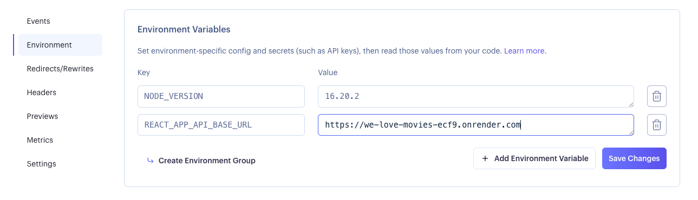

# WeLoveMovies Frontend Application

This is the Front End Application for the WeLoveMovies project. Follow the instructions below.

## Installation

1. Fork / clone this repository.
1. Run `npm install`.

Use `npm start` to run the application.

## Deployment

1. On Render (or similar deployment platform), set two Environment variables to enable sucessful deploy and functioning:

`NODE_VERSION` : `16.20.2` (allows application to build correctly)

`REACT_APP_API_BASE_URL` : `https://we-love-movies-ecf9.onrender.com` (or correct production url)

Example:

